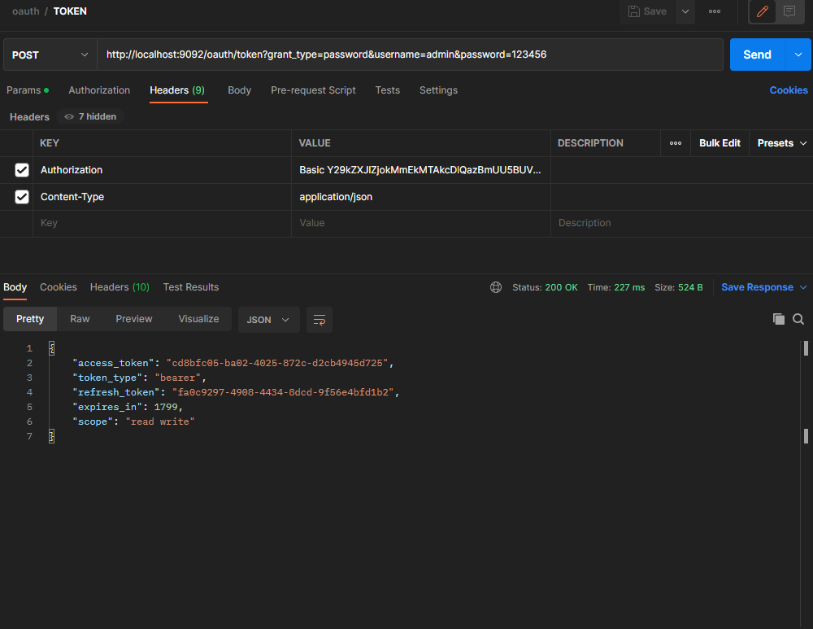
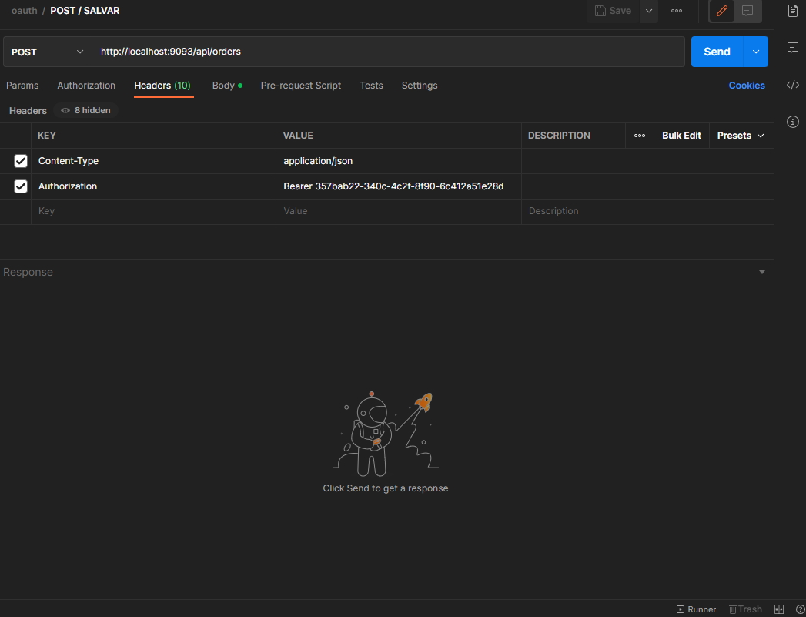
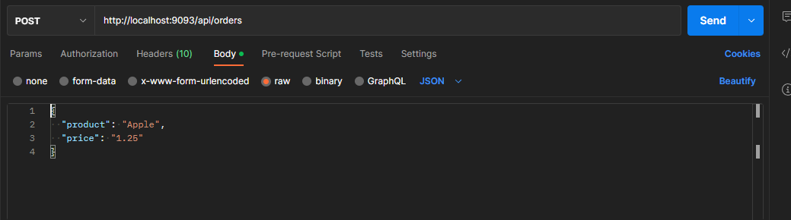
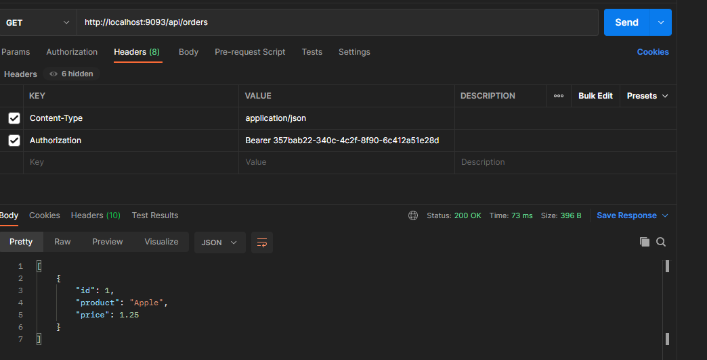
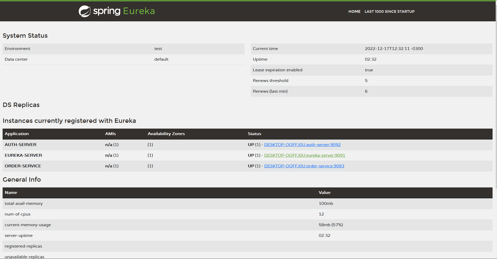
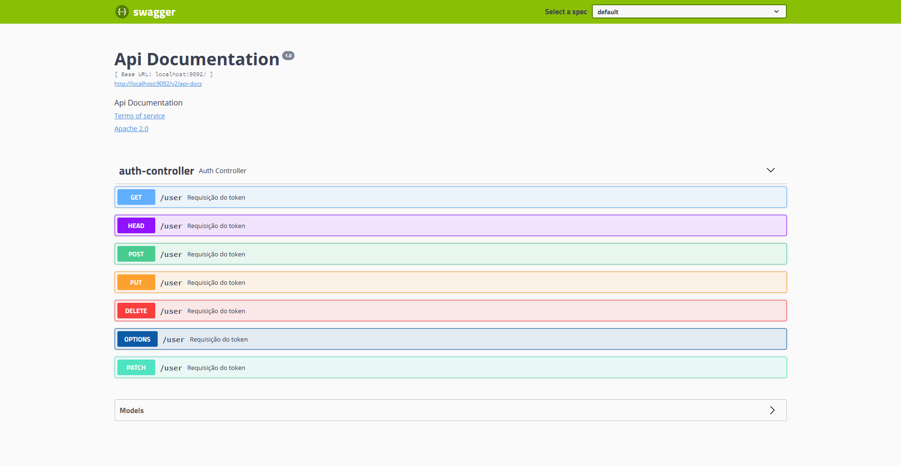

# delivery-microservice

# Token

 POST: http://localhost:9092/oauth/token?grant_type=password&username=admin&password=123456
 
 

  

 
 # Order
 
 POST: http://localhost:9093/api/orders
 
 * HEADER
 
 Authorization: Bearer + token (Bearer 357bab22-340c-4c2f-8f90-6c412a51e28d)
 Content-Type: application/json
 
 * BODY
 
 {
  "product": "Apple",
  "price": "1.25"
}

  

  

GET: http://localhost:9093/api/orders

 * HEADER
 
 Authorization: Bearer + token (Bearer 357bab22-340c-4c2f-8f90-6c412a51e28d)
 Content-Type: application/json
 
 

  

 
 # Eureka Server
 
 http://localhost:9091/
 
 

  

 
 # Config Server
 
 https://github.com/Gabriel-Venancio/delivery-configs
 
 # Swagger
 
 * http://localhost:9092/swagger-ui.html#/auth-controller
  

  

 * http://localhost:9093/swagger-ui.html#/order-controller
 

  

